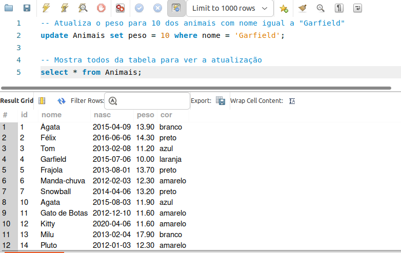
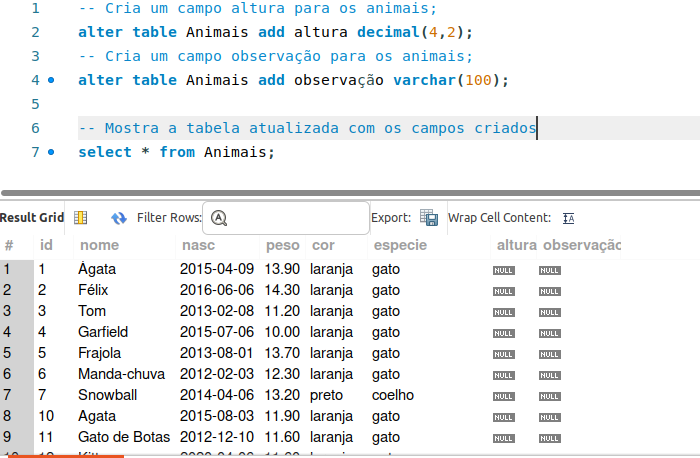
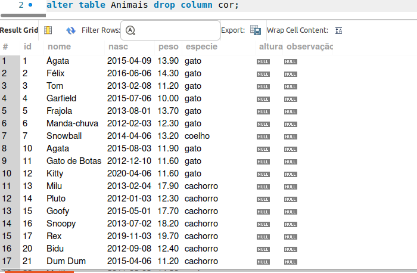

# base_de_dados_animais

## Para está atividade duplique a base de dados utilizada na ATIVIDADE INDIVIDUAL – TEMA: BASE DE DADOS ANIMAIS;

## Após a criação de uma nova base, execute os códigos abaixo:

### Altere o nome do Pateta para Goofy;

### Altere o peso do Garfield para 10 quilogramas;

### Altere a cor de todos os gatos para laranja;

### Crie um campo altura para os animais;
### Crie um campo observação para os animais;

### Remova todos os animais que pesam mais que 200 quilogramas.

### Remova todos os animais que o nome inicie com a letra ‘C’.

### Remova o campo cor dos animais;

### Aumente o tamanho do campo nome dos animais para 80 caracteres; 
### Remova todos os gatos e cachorros.

### Remova o campo data de nascimento dos animais.

### Remova todos os animais.
### Remova a tabela especies.

Caso não tenha os registros dos animais indicados para o teste faça um INSERT para realização da atividade;

Execute essas atividades dentro o Oracle Workbench;

Crie um repositório remoto e envie o script em SQL;

Produza o Readme do repositório remoto e tire um print da tela após o término da atividade;

Coloque comentários em seu código.

Código Documentado: 
